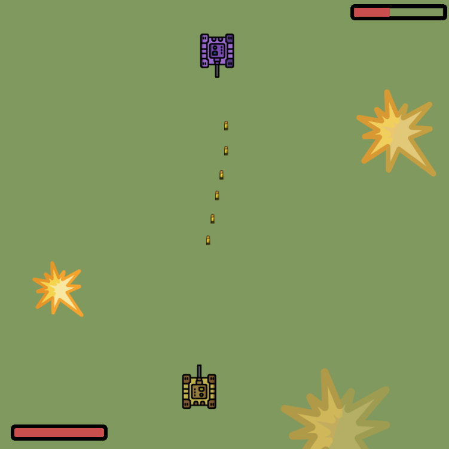

### Exercise 00 — Tanks!
| Exercise 00: Tanks! | |
| ------ | ------ |
| Turn-in directory | ex00 |
| Files to turn-in | TanksClient-folder, TanksServer-folder |

JavaFX enables the creation of high-quality desktop applications. Despite the fact that JavaFX is not very popular in corporate development, this technology is used in a wide range of "private" solutions. JavaFX is also a good tool for exploring the mechanisms of the Java programming language.

Your goal is to implement a client/server game where the Socket server allows two JavaFX clients to play a tank game with each other. An example of the client-side appearance is shown below:

So the game should allow two users to "drive" their tank and reduce the enemy's HP by shooting.

**Game Mechanics** :
1. A tank can only move horizontally by pressing the left and right arrow keys. Holding down the respective keys will result in a continuous movement in that direction.
2. A tank cannot move beyond the edge of the field.
3. Pressing the spacebar once will fire a shot. It is not possible to fire a series of shots by holding down the key.
4. Hitting the target will remove 5 HP from the enemy.
5. Both players start with 100 HP.
6. The player is always at the bottom of the screen, while the enemy is at the top.
7. Tanks can only move when both players are connected to the server.

**Additional requirements**:
- Interface must be able to connect to a specific server.
- When either player wins, a modal box should appear with the stats of shots, hits and misses.
- These stats are stored in a DBMS on the server.
- JavaFX client should have an executable jar archive that can be launched like a normal application (by clicking on the file).
- README.md file should be prepared with a set of instructions for application assembly and startup.
